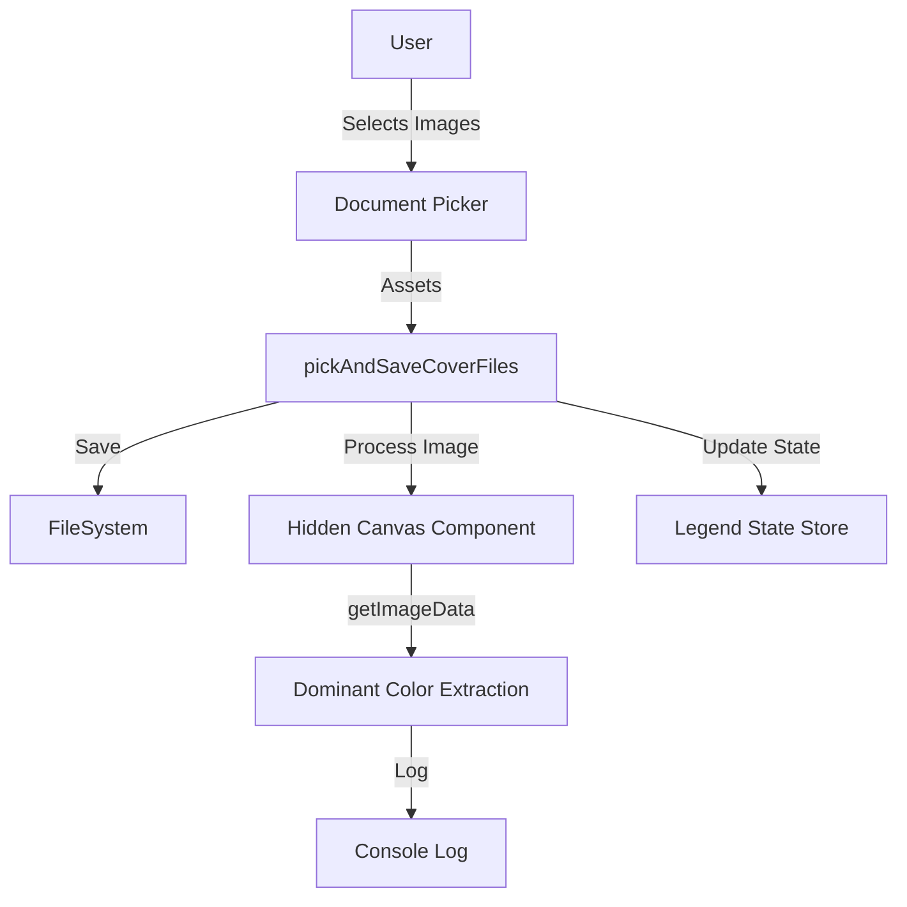

# Requirements

### Overview & Goals
The goal is to implement dominant color calculation for cover images when they are imported into the app via the `pickAndSaveCoverFiles` service. This will allow the app to eventually use these colors for UI styling (e.g., background gradients in the player).

### Scope
*   **In Scope**:
    *   Calculating the top 5 dominant colors for iOS and Android targets during the file import process.
    *   Refactoring existing image processing code in `src/services/player/cover.ts` to support sequential async processing.
    *   Integrating a hidden `Canvas` component in the `PlayerLoad` screen to perform the calculation.
    *   Logging the results to the console for verification.
*   **Out of Scope**:
    *   Dominant color calculation for the Web target.
    *   Calculation for online/remote image sources.
    *   Persisting the dominant color to the `CoverFile` record (to be implemented after the user decides which color to use).
    *   Adding new native dependencies (the solution must work with standard Expo Go).

### User Stories
*   As a user, I want the app to analyze my imported cover images so that it can later provide a more immersive and color-coordinated experience.
*   As a developer, I want to see the extracted dominant colors in the logs so that I can evaluate the accuracy of the extraction algorithm.

### Functional Requirements
*   When a user selects cover images to import, the app must process each image to extract dominant colors.
*   The extraction must happen after the image is saved to the internal filesystem.
*   The top 5 dominant colors must be printed to the console for each imported image.
*   The import process should remain robust and handle cases where color extraction might fail (e.g., corrupted images).

# Technical Design

### Current Implementation
*   `pickAndSaveCoverFiles` in `src/services/player/cover.ts` handles the picking and saving of images but does not currently perform any analysis.
*   `processImage` and `getTop5DominantColors` are partially implemented in `cover.ts` but are not integrated into the import flow.
*   `processImage` currently relies on a `Canvas` reference which is not passed to the service.

### Key Decisions
*   **Use `react-native-canvas`**: Since development builds are not allowed, we use the WebView-based `react-native-canvas` which is compatible with Expo Go and provides access to raw pixel data via the standard HTML5 Canvas API.
*   **Sequential Processing**: We will process images one by one using a single hidden canvas. This avoids overloading the WebView and simplifies state management during the extraction loop.
*   **Hidden Canvas in UI**: A hidden `Canvas` component will be added to the `PlayerLoad` screen. This is necessary because `react-native-canvas` requires a component to be present in the view hierarchy to function.

### Proposed Changes

#### Image Processing Refactoring (`src/services/player/cover.ts`)
*   Convert `processImage` into a Promise-based utility that resolves with an array of hex colors.
*   Add error handling for image loading and data extraction.

#### Service Integration (`src/services/player/cover.ts`)
*   Update `pickAndSaveCoverFiles` to accept `canvasRef`.
*   Wait for the file copy operation to complete before initiating extraction.
*   Iterate through assets, extract colors, and log them.

#### UI Integration (`src/app/(main)/(tabs)/player/PlayerLoad.tsx`)
*   Add a `Canvas` component with hidden styles.
*   Provide the `canvasRef` to the import handler.

### File Structure
*   `src/services/player/cover.ts`: Refactored `processImage` and updated `pickAndSaveCoverFiles`.
*   `src/app/(main)/(tabs)/player/PlayerLoad.tsx`: Added hidden `Canvas` and ref management.

### Architecture Diagram

### Risks
*   **Performance**: Processing many high-resolution images might be slow due to the overhead of passing pixel data through the React Native bridge from the WebView. We mitigate this by resizing images to 50x50 on the canvas before extraction.
*   **Memory**: Large images converted to base64 for the canvas might consume significant memory. Sequential processing helps manage this by ensuring only one image is handled at a time.

# Testing

### Validation Approach
Verification will be performed by importing various images and observing the console output in an Expo Go environment (iOS or Android).

### Key Scenarios
*   **Single Image Import**: Import one JPEG image. Verify that exactly 5 dominant colors are logged.
*   **Multiple Image Import**: Import a batch of mixed JPEG and PNG images. Verify that colors are logged sequentially for each image.
*   **Dark/Black Images**: Import a mostly black image. Verify that the fallback mechanism in `getTop5DominantColors` returns `#000000`.
*   **Transparent Images**: Import a PNG with transparency. Verify that the algorithm correctly ignores transparent pixels as per the `a < 128` check.

### Edge Cases
*   **Missing Canvas Ref**: Verify that the import still completes successfully (without color extraction) if the canvas ref is not available for some reason.
*   **Unsupported File Format**: Verify that the picker filters for only JPEG and PNG, preventing issues with other formats.
*   **Web Target**: Verify that no color extraction is attempted on the web, preserving existing functionality.

# Delivery Steps

### ✓ Step 1: Refactor processImage to be Promise-based
Refactor the `processImage` function in `src/services/player/cover.ts` to be async and return a Promise.
- Update `processImage` to return `Promise<string[]>`.
- Implement `image.addEventListener('load', ...)` to resolve the Promise with the extracted colors.
- Implement `image.addEventListener('error', ...)` to reject the Promise on failure.
- Ensure `ctx.getImageData` is properly awaited and the result is passed to `getTop5DominantColors`.

### ✓ Step 2: Integrate color extraction into pickAndSaveCoverFiles
Update `pickAndSaveCoverFiles` to accept a `canvasRef` and perform color extraction during the import process.
- Update the function signature in `src/services/player/cover.ts` to accept `canvasRef?: React.RefObject<Canvas | null>`.
- Change `void sourceFile.copy(destinationFile)` to `await sourceFile.copy(destinationFile)` to ensure the file is available before processing.
- Within the loop, call `await processImage(destinationFile.uri, canvasRef)` for each imported image.
- Log the extracted dominant colors for each file using `console.log`.

### ✓ Step 3: Implement hidden Canvas in PlayerLoadScreen
Add a hidden `Canvas` component to the `PlayerLoadScreen` to facilitate image processing.
- Import `Canvas` from `react-native-canvas` in `src/app/(main)/(tabs)/player/PlayerLoad.tsx`.
- Create a `canvasRef` using `useRef<Canvas>(null)`.
- Render a hidden `Canvas` component (using absolute positioning off-screen) within the screen's layout.
- Pass the `canvasRef` to the `pickAndSaveCoverFiles` call in `handleLoadCovers`.